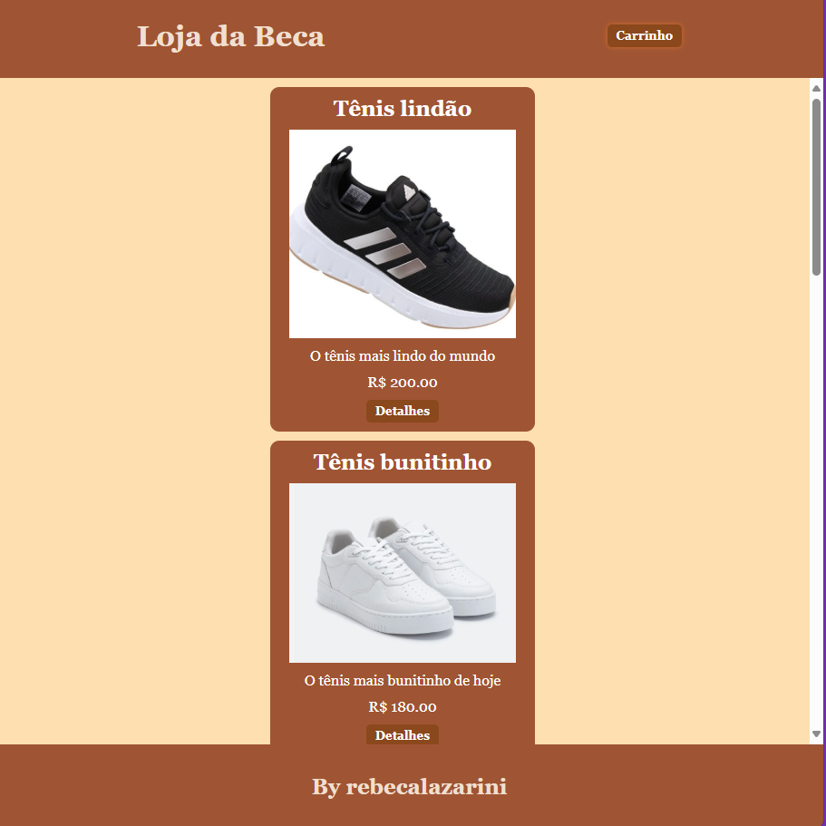
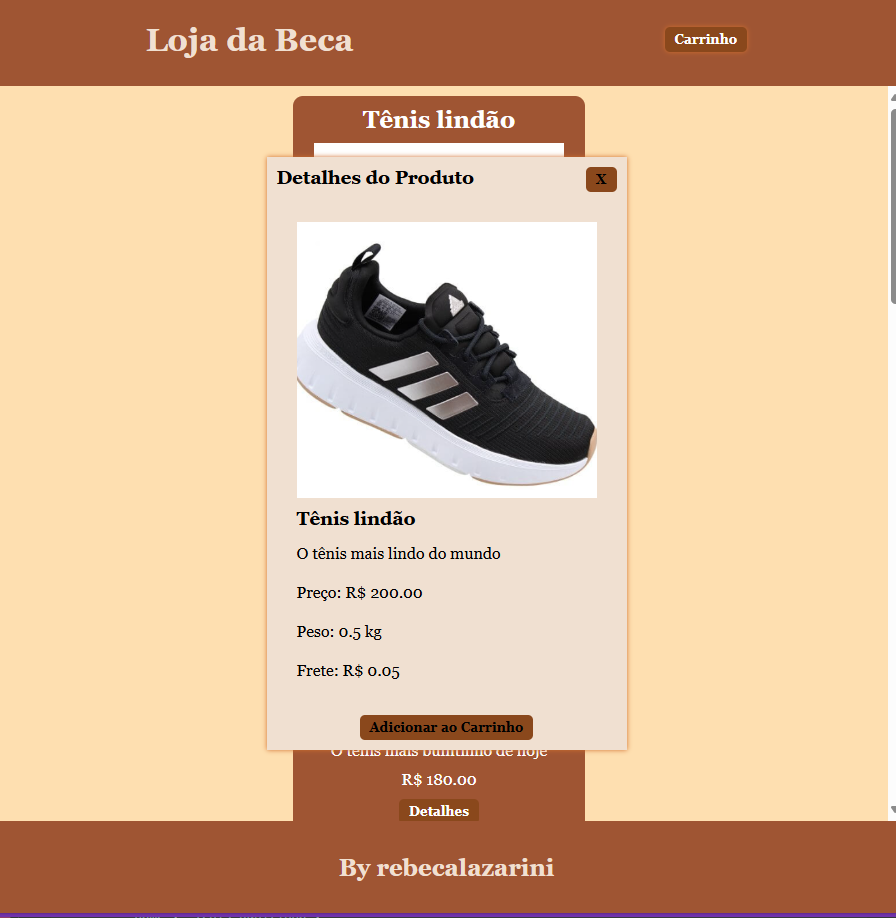
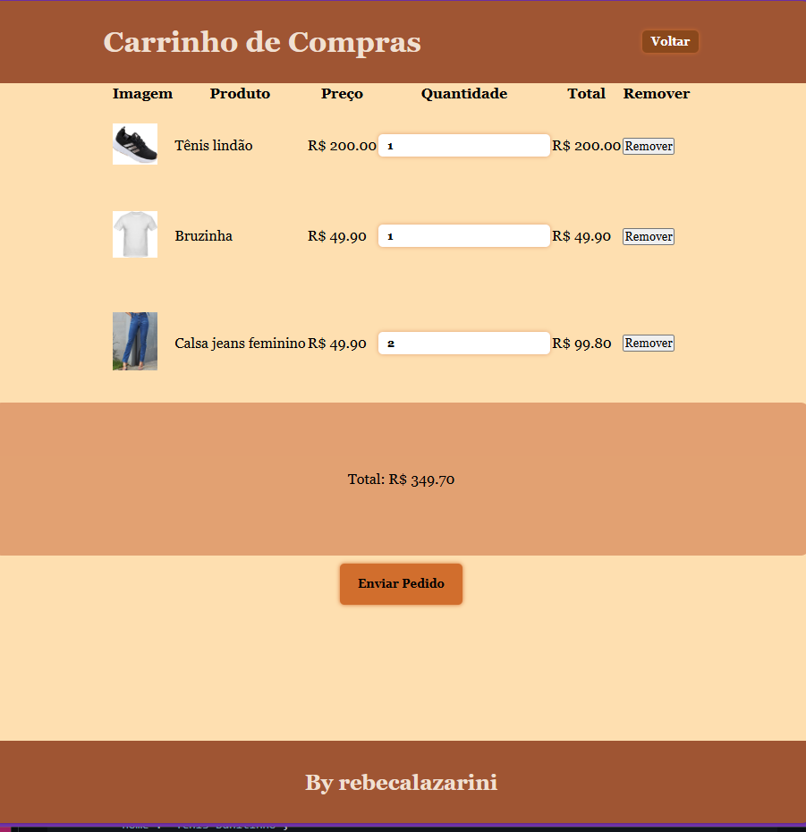
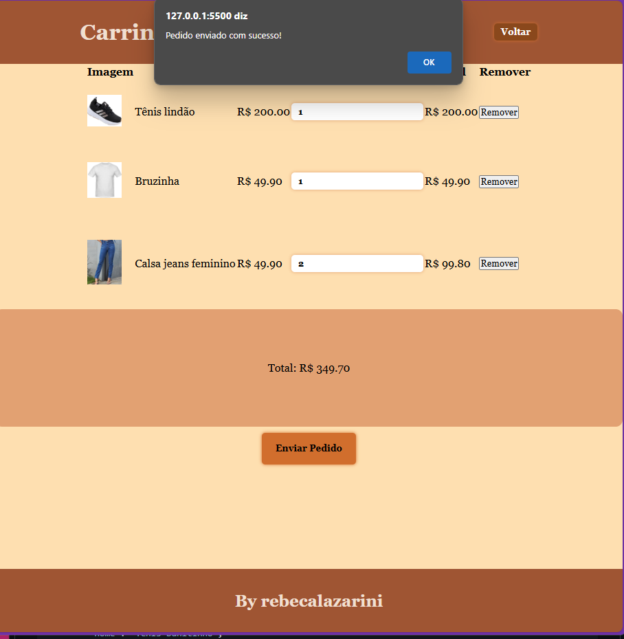

# revisão front

## Tecnologias 
- VsCode (IDE)
 - HTML: HTML5
 - CSS: CSS3
 - JavaScript: Vanilla JS

 - Paleta de cores :
    - #A0522D (SaddleBrown)
    - #8B4513 (SaddleBrown)
    - #D2691E (Chocolate)
    - #F4A460 (SandyBrown)
    - #FFDEAD (NavajoWhite)

    ## Prints dos testes

    ## Funcionalidades tela index.html
- [ ] A página deve ser carregada com os produtos em formato de cards (pelo menos 6 produtos provenientes do JSON abaixo), os produtos são apenas exemplos podem ser alterados, mas devem ter as seguintes informações: id, imagem, nome, descrição, preço, peso e frete.
- [ ] Ao clicar no botão **Detalhes** o produto deve abrir em um modal com as informações do produto (imagem, nome, descrição, preço, peso e frete).
    - [ ] O modal deve ter um botão **X** que fecha o modal.
    - [ ] O frete deve ser calculado com base no peso do produto e o valor do frete deve ser 10% do peso do produto (peso * 0.1). O valor do frete deve ser exibido no modal.
    - [ ] O preço deve ser exibido com duas casas decimais e o símbolo de R$ (ex: R$ 49,90).
- [ ] Ao clicar no botão **Adicionar ao Carrinho** o produto deve ser adicionado ao carrinho de compras (Uma lista que deve ser salva em localStorage para que possa ser vista na outra tela [carrinho.html]).

## Funcionalidades tela carrinho.html
- [ ] A página deve ser carregada com os produtos adicionados ao carrinho (provenientes do localStorage).
- [ ] O carrinho deve exibir os produtos adicionados com as seguintes informações: imagem, nome, preço e quantidade (a quantidade deve ser exibida em um campo de input do tipo number).
    - [ ] O carrinho deve permitir que o usuário altere a quantidade de cada produto (o valor deve ser salvo no localStorage).
    - [ ] O carrinho deve remover o produto do carrinho quando a quantidade for = 0.
- [ ] O carrinho deve exibir o valor total do carrinho (soma dos preços dos produtos multiplicados pela quantidade de cada produto). O valor total deve ser exibido com duas casas decimais e o símbolo de R$ (ex: R$ 49,90).
- [ ] Ao clicar no botão **Enviar pedido** o carrinho deve ser limpo (localStorage) e o usuário deve ser redirecionado para a página index.html com uma mensagem de sucesso (ex: "Pedido enviado com sucesso!").
- [ ] Ao clicar no botão **Voltar** ou **<-** deve apenas voltar a tela inicial sem limpar o carrinho, para continuar comprando.

